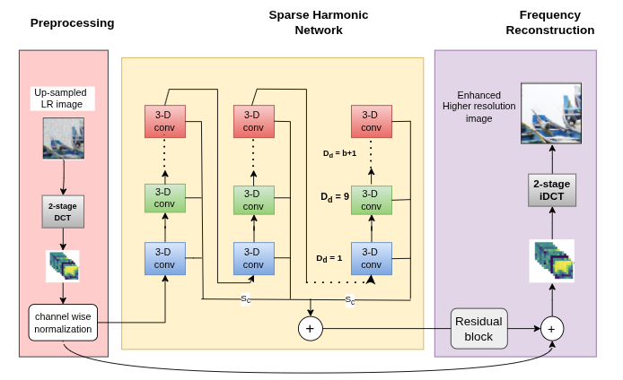
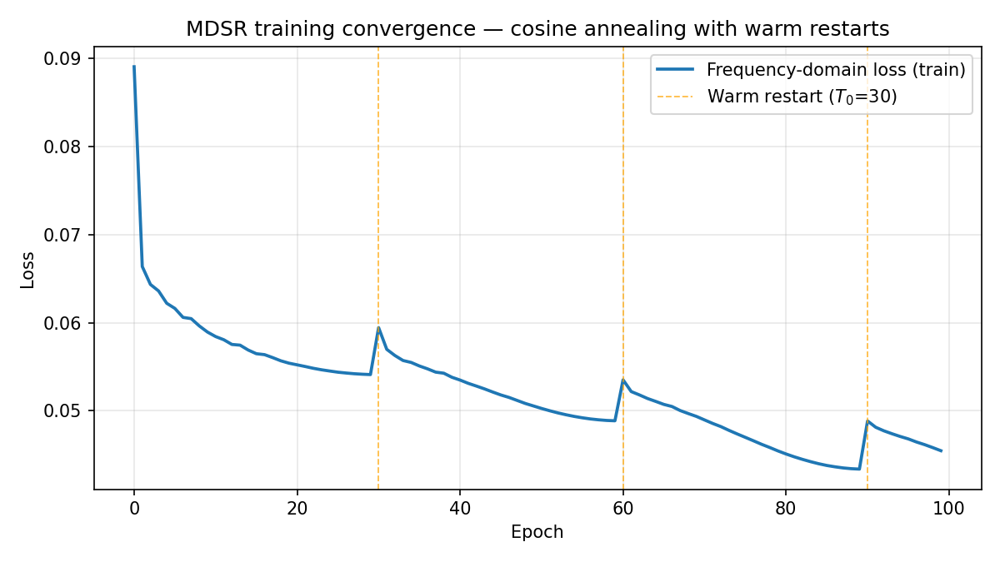
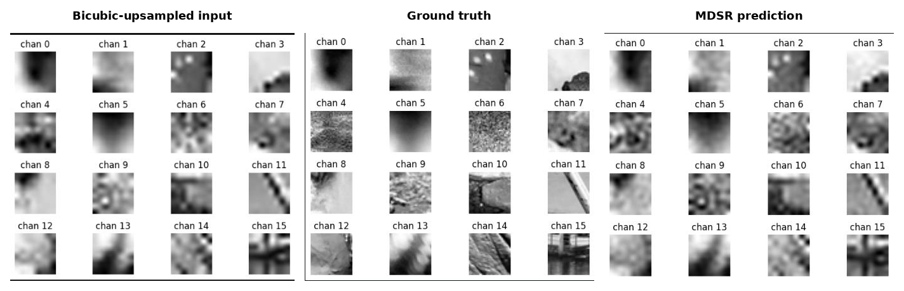

# MDSR — Multi-Scale DCT Super-Resolution Network

A single-stream **frequency-domain** image super-resolution network that operates entirely on Discrete Cosine Transform (DCT) coefficient maps — no spatial-domain stream required.

Built in PyTorch as our **EPICS Phase II major project at VIT Bhopal University** (2025–26).



---

## The idea

Most super-resolution networks (SRCNN, EDSR, SwinIR) work on pixels. Frequency-domain approaches like **FreqNet** (Cai et al., 2021) reframe SR as *reconstructing the missing high-frequency DCT coefficients* of an image — but FreqNet needs **two parallel streams**: a Spatial Extraction Network (SEN) plus a Frequency Reconstruction Network (FRN).

**Our observation:** the DCT is a lossless linear transform, so all the spatial structure the SEN extracts is *already encoded* in the harmonic relationships between DCT coefficients. The spatial stream is redundant.

**MDSR** replaces the dual-stream design with a single-stream **Sparse Harmonic Convolution Network (SHCN)** that audits those harmonic relationships directly.

## Architecture

```
LR patch (32×32)
   │  bicubic ×4 upsample → YCbCr → 32×32-block DCT → top 10×10 coeffs
   ▼
DCT feature map (100, 4, 4)  +  channel-wise z-score normalization
   │
   ▼
SHCN  — 8 repeats × 10 blocks (80 blocks total)
   │     each block: 3×3 Conv2d expand (100→200)
   │                 → Conv3d (5,3,3) with depth dilation D_d = l + 1
   │                 → 3×3 Conv2d project (200→100)
   │                 → dual PReLU outputs (backbone + skip)
   ▼
(skip_sum + backbone) × 0.1     ← stabilization scaling
   │
   ▼
Residual Reconstruction Network — 7 residual groups × 10 blocks
   │
   ▼ + global residual (input DCT map)
Enhanced DCT map → merge with cached low-freq coeffs → inverse DCT
   │
   ▼
Super-resolved patch
```

**Key design choices** (full reasoning in the Phase II report):

- **Linear dilation schedule `D_d = l + 1`** instead of Conv-TasNet's exponential `2^l` — exhaustively covers every harmonic distance within the 8×8 DCT block geometry rather than skipping intermediate distances.
- **Conv3d depth-dilation treats the 100 frequency channels as a structured depth axis**, sampling channels at harmonically spaced intervals — something depthwise Conv2d cannot do.
- **Asymmetric (5,3,3) kernel** — wider receptive field along frequency (where harmonic relationships span multiple positions) than along the small 4×4 spatial grid.
- **0.1 output scaling** keeps the SHCN contribution a small perturbation early in training so the clean low-frequency content of the residual path is preserved.
- **Frequency-domain Charbonnier loss** with ring-based channel weights emphasizing perceptually critical mid-frequency bands (per FreqNet).

~38M parameters total (≈13.2M in the reconstruction network).

## Results (work in progress)

Training is ongoing. Current status, from Phase II:

- Trained 115+ epochs on a representative subset (~5.4K of 20K patch samples) with cosine-annealing warm restarts (`T_0 = 30`)
- Frequency-domain loss converged 0.055 → **0.0398**, with the model reconstructing high-frequency AC coefficients and fine textural residuals


- Benchmark PSNR/SSIM on standard test sets (Set5/Set14) and ablations (±SHCN, ±repeat feedback, kernel/dilation variants) are **pending** — this section will be updated



## Engineering notes

The original HDF5 pipeline loaded the full dataset into RAM via `f[key][:]` and overflowed on large datasets. We migrated to a **single-file LMDB** store with:

- memory-mapped random access (`readahead=False`, `meminit=False`)
- **lazy per-worker environments** — DataLoader workers are separate processes, so each opens its own handle on first read (`lock=False` enables concurrent reads)
- pinned memory + prefetching + persistent workers

`benchmark_dataloader.py` measures the resulting throughput.

## Repository structure

```
├── config.py                  # all paths + hyperparameters (env-var overridable)
├── dataset.py                 # HDF5 and LMDB Dataset classes
├── data_preparation.py        # raw patches → DCT feature maps → HDF5/LMDB
├── train.py                   # training entry point
├── benchmark_dataloader.py    # LMDB DataLoader throughput benchmark
├── notebooks/
│   └── inference_evaluation.ipynb   # checkpoint inference + PSNR/SSIM + visualizations
├── model_utils/               # MDSR model, SHCN blocks, losses
├── utils/                     # DCT / vectorization helpers
└── assets/                    # README figures
```

## Setup

```bash
git clone https://github.com/sandeepsolanki341/mdsr-frequency-super-resolution.git
cd mdsr-frequency-super-resolution
pip install -r requirements.txt
```

Place your LMDB dataset at `data/train_data.lmdb` (or point `MDSR_DATA_DIR` elsewhere), then:

```bash
python train.py                      # train
python benchmark_dataloader.py      # measure data throughput
jupyter notebook notebooks/inference_evaluation.ipynb   # evaluate a checkpoint
```

> **Note:** training data is not included in this repo. The LMDB store is built from 32×32 image patches converted to 100-channel DCT feature maps (preprocessing per FreqNet / Park & Johnson 2023).

## Team

Developed by a six-member student team as our EPICS Phase II major project at VIT Bhopal University, under the supervision of Dr. Garima Jain. My role on the team: Model Evaluation & Performance Analysis.

## References

Key prior work this project builds on:

1. Cai et al. (2021) — *FreqNet: A Frequency-domain Image Super-Resolution Network with DCT* (arXiv:2111.10800)
2. Srinivasan et al. (2025) — *Learning Single-Image Super-Resolution in the JPEG Compressed Domain* (arXiv:2512.04284)
3. Luo et al. (2019) — *Conv-TasNet* (IEEE/ACM TASLP) — dilated-convolution precedent for SHCN
4. Lim et al. (2017) — *EDSR* (CVPRW)
5. Park & Johnson (2023) — *RGB No More: Minimally-Decoded JPEG Vision Transformers* (CVPR)

Full reference list in the Phase II project report.
